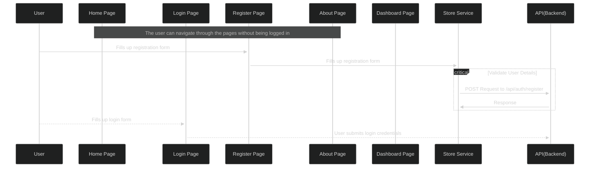

# Introduction

Welcome to Nextra! This is a basic docs template. You can use it as a starting point for your own project :)

## What is Nextra?

A **simple**, **powerful** and **flexible** site generation framework with everything you love from Next.js.

## Documentation

The documentation is available at [https://nextra.site](https://nextra.site).

